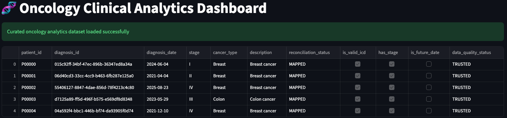
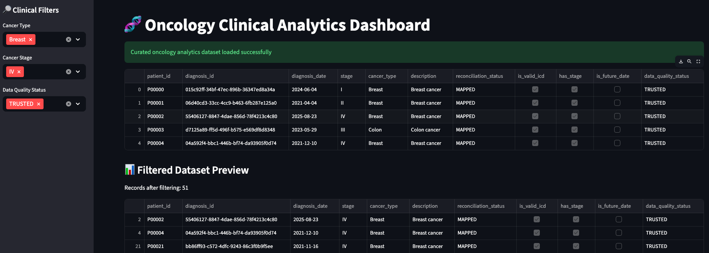

# 🧬 Oncology Clinical Analytics POC

## Overview
This project demonstrates a **clinical data analytics workflow** commonly used in **oncology and healthcare data platforms**. It focuses on **data quality, standardization, reconciliation, and safe analytics consumption**, ending with an **interactive Streamlit dashboard** suitable for clinical and business stakeholders.

The POC mirrors real-world patterns used in **EHR / oncology analytics pipelines**, while remaining **fully local, reproducible, and cost-free**.

---

## 🎯 Objectives
- Ingest raw clinical encounter data
- Standardize clinical terminology (ICD-10)
- Profile and validate oncology datasets
- Apply rule-based data quality checks
- Reconcile clinical records against reference data
- Produce a **curated analytics dataset**
- Present insights via an **interactive Streamlit dashboard**
- Surface **data trust context** alongside analytics

---

## 🏗️ High-Level Architecture (Conceptual)
```text
Clinical Source Files (CSV / JSON)
        ↓
RAW Layer (data/raw)
        ↓
Profiling & Validation (Python)
        ↓
Reconciliation & Quality Rules
        ↓
CURATED Layer (data/curated)
        ↓
Analytics & Dashboard (Streamlit)
```

> This design maps cleanly to cloud-native architectures  
> (ADLS → Synapse Spark → Delta Lake → Serverless SQL).

## 📂 Project Structure

```text
oncology-clinical-data-poc/
│
├── dashboard/
│   └── app.py                  # Streamlit analytics dashboard
│
├── data/
│   ├── raw/                    # Raw clinical datasets
│   ├── reference/              # ICD-10 and clinical reference data
│   └── curated/                # Analytics-ready datasets
│
├── src/
│   ├── data_generation/        # Synthetic data generation
│   ├── profiling/              # Data profiling & exploration
│   ├── quality/                # Data quality rules
│   └── reconciliation/         # Source-to-reference reconciliation
│
├── docs/                       # Clinical & business documentation
├── sql/                        # SQL-based analysis (optional)
├── requirements.txt
└── README.md
```

## 🧪 Key Data Quality Rules

The following data quality rules are applied to ensure **clinical accuracy, trust, and usability** of oncology data:

| Rule | Severity | Description |
|------|----------|-------------|
| Valid ICD-10 Code | Critical | Diagnosis must map to a valid ICD-10 reference |
| Cancer Stage Present | Critical | Oncology staging is mandatory for analysis |
| Diagnosis Date Sanity | Warning | Diagnosis date cannot be in the future |
| Patient Reference Integrity | Critical | Diagnosis must link to a valid patient |

Each rule is **clinically meaningful, measurable, and explainable** to both technical and non-technical stakeholders.

## 🧬 Curated Analytics Dataset

**File:** `data/curated/oncology_analytics.csv`

This dataset represents the **trusted analytics layer** produced after profiling, validation, and reconciliation.

### Includes:
- Clinical attributes:
    - Cancer type
    - Cancer stage
    - Diagnosis date
- Standardized clinical terminology (ICD-10)
- Reconciliation status:
    - `MAPPED`
    - `UNMAPPED`
- Explicit data quality flags
- Derived trust indicator:
    - `TRUSTED`
    - `REVIEW_NEEDED`

This dataset functions as a **Gold / Delta analytics layer**, suitable for reporting and dashboards.

## 📊 Interactive Dashboard (Streamlit)

The curated analytics dataset is consumed through an **interactive Streamlit dashboard** designed for clinical and business users.

The dashboard enables:
- Safe exploration of oncology data
- Clinical cohort analysis
- Visibility into data quality and trust
- Clear separation between raw data and analytics consumption

This mirrors how analytics teams expose **trusted clinical data** to downstream users in real-world healthcare platforms.


## ▶️ Running the Dashboard Locally

The interactive dashboard is built using **Streamlit**, a lightweight framework for creating data applications in Python.

### Run the dashboard
From the project root directory, execute:

```bash
streamlit run dashboard/app.py
```
---
## 🖥️ Dashboard Preview

Below are sample views from the interactive Streamlit dashboard, demonstrating how clinical users can safely explore oncology data.

---
### 🧬 Oncology Clinical Analytics Dashboard
High-level overview of oncology diagnoses with standardized clinical attributes and reconciliation status.


---
### 📊 Filtered Dataset Preview
Preview of the curated, filtered dataset after applying clinical and data quality filters.


---
